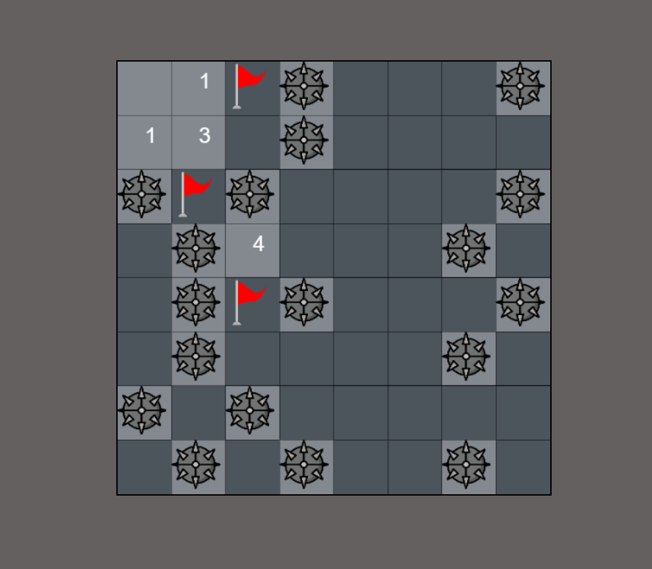

## Recreating minsweeper old classic game in vanilla JS.

**Easy to play**

*Goal is to reveal all the numbers*
- Right click to set flag, if you think there is mine under the cell.
- Left click to reveal number.
- If revealed cell has mine, you loose.
- Number represent how many mines are there in its [moore neighbourhood](https://en.wikipedia.org/wiki/Moore_neighborhood)

